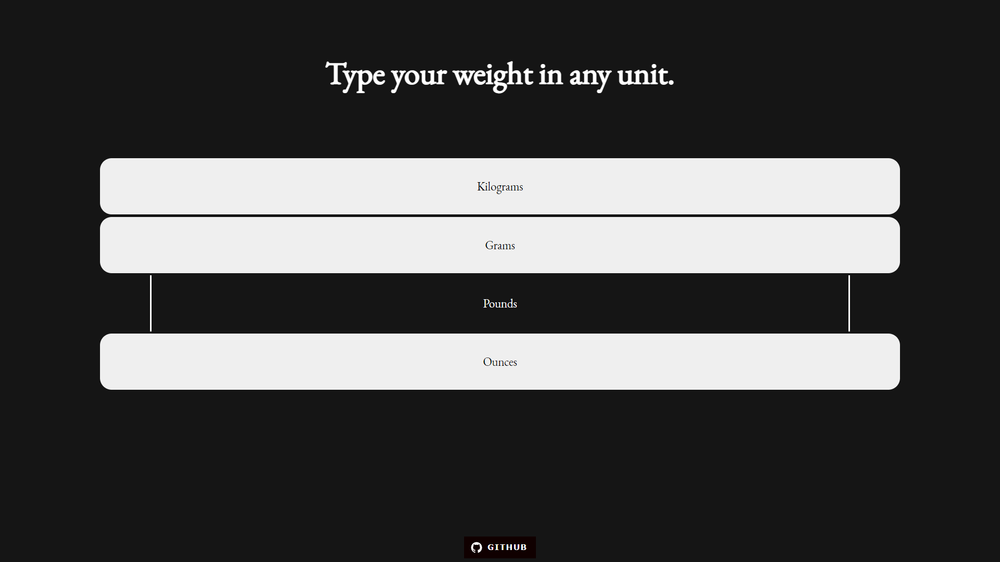
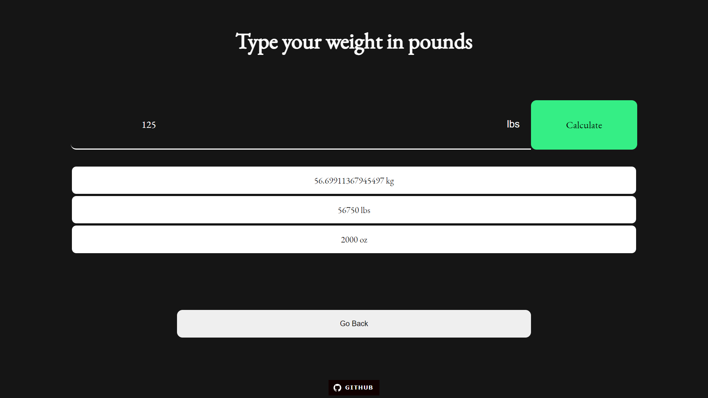

## Hi, I'm Sagar Sharma
## This the latest release of Weight Converter 

### [View Demo](https://sagar-sharma-7.github.io/Weight-Converter/public/index.html)


<br>

<p align="center">
  
  <br>
  
</p>

<br>

## Text Editor


## Languages Used
<p float="left">

 
 
 
 
 

</p>

<hr>
 
## Font Used
```css 
@import url('https://fonts.googleapis.com/css2?family=EB+Garamond&family=Merienda&display=swap');

body{
  font-family: 'EB Garamond', serif;
}
```
=======


 <hr>


 ## Cloning this repositary using command line
 1. Open **Git Bash**.
 1. Change the current working directory to the location where you want the cloned directory.
 1. Type `git clone https://github.com/Sagar-Sharma-7/Weight-Converter.git`
 1. Press **Enter** to create the clone of this repositary.


 ## How to reach me?
 [ ](mailto:6969sagarsharma@gmail.com)
 <hr>
 
 [](https://github.com/Sagar-Sharma-7)
 <hr>
 <br>
 <p float="left">

[](https://github.com/Sagar-Sharma-7)
[ ](https://github.com/Sagar-Sharma-7)

</p>

[](https://github.com/Sagar-Sharma-7)


